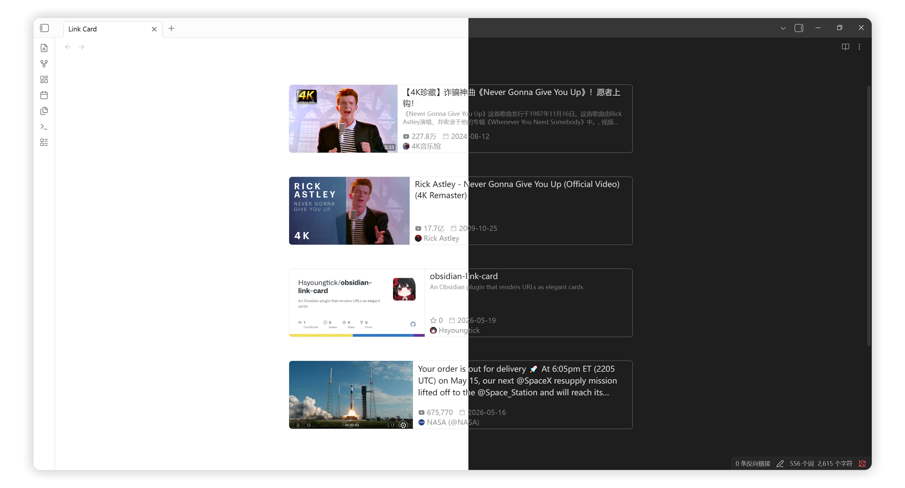

<div align="center">

### Link Card

An Obsidian plugin that renders URLs as elegant cards

English / [中文](README_zh.md)



</div>

## 💻 Features

- **Paste to Render** — Automatically converts pasted URLs into card links
- **Fallback Chain** — Tries in order: specialist parser → HTML meta tags → third-party API (Microlink)
- **Specialist Parsers** — Enhanced metadata extraction for specific websites:
  - 🎬 **Bilibili** — Video info (views, duration, author name), author avatar, cover image
  - 🎬 **YouTube** — Video info (views, author name), author avatar, cover image
  - 🐙 **GitHub** — Repository info (stars, author name, repo name), OpenGraph cover
  - 🐦 **X/Twitter** — Tweet content, views, author avatar, cover image (via [Nitter](https://github.com/zedeus/nitter) proxy)
- **Data Caching** — Avoids repeated requests for the same URL
- **Dynamic Layout** — Automatically adjusts layout based on image width
- **Dark Mode** — Cards follow Obsidian's light/dark mode
- **Bilingual UI** — Chinese and English interface

## 🚀 Quick Start

### Option 1: Install via BRAT

1. Install [BRAT](https://github.com/TfTHacker/obsidian42-brat)
2. Open BRAT settings → **Add Beta plugin**
3. Paste the repository URL: `https://github.com/Hsyoungtick/obsidian-link-card`
4. Enable the plugin

### Option 2: Manual Install

1. Download `main.js`, `styles.css`, `manifest.json` from [Releases](https://github.com/Hsyoungtick/obsidian-link-card/releases)
2. Move them to `.obsidian/plugins/link-card/`
3. Enable the plugin in Obsidian settings

## 📖 Usage

### Paste URL

- Copy a URL and paste it — it will automatically be converted to a card link

### Context Menu

- Select a URL, right-click → **Render as card**

## ⚙️ Configuration

| Setting | Description | Default |
| --- | --- | --- |
| Paste URL as card | Fetch metadata automatically when pasting a URL | `true` |
| Context menu command | Add command to the right-click menu | `true` |
| Follow color scheme | Cards follow Obsidian dark/light mode | `true` |
| Enable cache | Cache fetched metadata | `false` |
| Cache expiry | How long to keep cached data (hours) | `24` |
| Fallback metadata API | Use Microlink when direct request fails | `true` |
| Bilibili API URL | Bilibili video API endpoint | `https://api.bilibili.com/x/web-interface/view` |
| X/Twitter proxy URL | Nitter instance URL for X/Twitter | `http://127.0.0.1:8080` |

### `cardlink` Syntax

The `cardlink` code block uses YAML syntax:

```cardlink
url: https://www.bilibili.com/video/BV1GJ411x7h7
title: "Video Title"
host: bilibili.com
image: https://example.com/cover.jpg
author: UP Author Name
views: 1.23M
duration: 10:30
date: 2024-01-15
```

### Property Reference

| Name | Required | Description |
| --- | --- | --- |
| `url` | ✅ | Link to open when clicking the card |
| `title` | ✅ | Link title |
| `description` | ❌ | Description text |
| `host` | ❌ | Domain name displayed on the card |
| `image` | ❌ | Thumbnail (supports internal links `[[image.png]]`) |
| `favicon` | ❌ | Favicon (used as avatar fallback) |
| `avatar` | ❌ | Author avatar image |
| `author` | ❌ | Author name |
| `date` | ❌ | Publish date |
| `views` | ❌ | View count |
| `duration` | ❌ | Video duration |
| `stars` | ❌ | Star count (GitHub) |
| `repo` | ❌ | Repository name (GitHub) |

### X/Twitter Configuration

To enable X/Twitter card links, you need to deploy a [Nitter](https://github.com/zedeus/nitter) instance:

1. Deploy Nitter (Docker recommended)
2. Enter the Nitter URL in the plugin settings (e.g., `http://127.0.0.1:8080`)

## 🎨 Custom Styles

Card styles are defined in `styles.css`. You can override them using [CSS snippets](https://help.obsidian.md/How+to/Add+custom+styles#Use+Themes+and+or+CSS+snippets).

## 🏗️ Development

```bash
# Install dependencies
pnpm install

# Development mode (watch file changes)
pnpm dev

# Production build
pnpm build
```

To auto-copy to your Vault during development, create `.devconfig.json`:

```json
{
  "vaultPluginPaths": [
    "/path/to/your/vault/.obsidian/plugins/link-card"
  ]
}
```

## 📌 Roadmap

- [ ] Support metadata extraction for more websites

## 💖 Acknowledgements

- Inspired by [obsidian-auto-card-link](https://github.com/nekoshita/obsidian-auto-card-link), [obsidian-nifty-links](https://github.com/x-Ai/obsidian-nifty-links), and [hexo-tag-bilibili-card](https://github.com/wherewhere/hexo-tag-bilibili-card)

## 🤖 Disclaimer

This project was generated with AI assistance. Use with discretion if this concerns you.

## 📝 License

[MIT](LICENSE)
